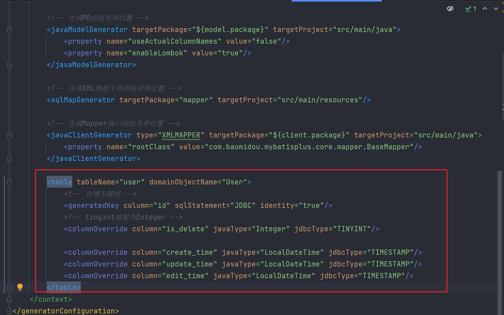

# SpringBoot 项目初始模板

> 作者：[fancier](https://github.com/hola1009)

基于 Java SpringBoot 的项目初始模板，整合了常用框架和主流业务的示例代码。

## 模板特点

### 主流框架 & 特性

- Spring Boot 2.7.x（贼新）
- Spring MVC
- MyBatis + MyBatis Plus 数据访问（开启分页）
- Spring Boot 调试工具和项目处理器
- Spring AOP 切面编程
- Spring 事务注解

### 数据存储

- MySQL 数据库
- Redis 内存数据库
- MINIO 对象存储

### 工具类

- Hutool 工具库
- Apache Commons Lang3 工具类
- Lombok 注解
- Guava 工具库

### 业务特性

- 业务代码生成器（支持自动生成 Service、Controller、数据模型代码）
- 全局请求响应拦截器（记录日志）
- 全局异常处理器
- 自定义错误码
- 封装通用响应类
- Swagger + Knife4j 接口文档
- 自定义权限注解 + 全局校验
- 多环境配置


## 业务功能

- 提供示例 SQL（用户）
- 用户登录、注册、注销、更新、检索、权限管理
- 支持分业务的文件上传


### 架构设计

- 合理分层


## 快速上手

> 所有需要修改的地方fancier都标记了 `todo`，便于大家找到修改的位置~

### MySQL 数据库

1）修改 `application.yml` 的数据库配置为你自己的：

```yml
spring:
  datasource:
    driver-class-name: com.mysql.cj.jdbc.Driver
    url: jdbc:mysql://localhost:3306/my_db
    username: root
    password: 123456
```

2）执行 `sql/create_table.sql` 中的数据库语句，自动创建库表

3）启动项目，访问 `http://localhost:8101/api/doc.html` 即可打开接口文档，不需要写前端就能在线调试接口了~


### Redis 分布式登录

1）修改 `application.yml` 的 Redis 配置为你自己的：

```yml
spring:
  redis:
    database: 1
    host: localhost
    port: 6379
    timeout: 5000
    password: 123456
```

2）修改 `application.yml` 中的 session 存储方式：

```yml
spring:
  session:
    store-type: redis
```

3）移除 `MainApplication` 类开头 `@SpringBootApplication` 注解内的 exclude 参数：

修改前：

```java
@SpringBootApplication(exclude = {RedisAutoConfiguration.class})
```

修改后：


```java
@SpringBootApplication
```

### 业务代码生成器

支持自动生成 Service、Controller、数据模型代码，配合 MyBatisX 插件，可以快速开发增删改查等实用基础功能。

找到 `generate.CodeGenerator` 类，修改生成参数和生成路径，并且支持注释掉不需要的生成逻辑，然后运行即可。

```
// 指定生成参数
String packageName = "com.yupi.mianshiya";
String dataName = "用户评论";
String dataKey = "userComment";
String upperDataKey = "UserComment";
```

生成代码后，可以移动到实际项目中，并且按照 `// todo` 注释的提示来针对自己的业务需求进行修改。

### 持久层代码生成
该模板整合了 mybatis generator 可用来生成 实体类 mapper 接口
1. 需要修改 generatorConfig.xml 配置文件, 来配置需要生成的实体类

